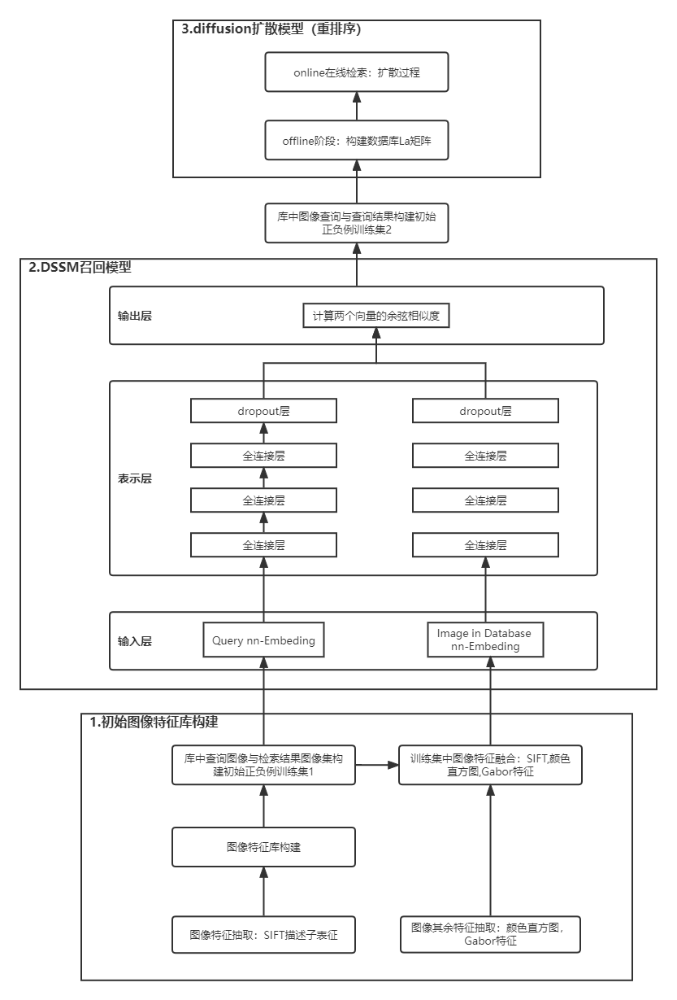

# 图像检索

## 架构
1.初始图像特征库构建：DatabaseInitializer.py

2.初始图像特征库加载、多特征提取与融合、召回模型训练集构建：DataGenerator.py

3.dssm召回模型训练与精排模型diffusion训练集构建：

4.diffusion扩散：精排模型训练

## 参考地址
https://github.com/fyang93/diffusion.git

https://github.com/epignatelli/scalable-recognition-with-a-vocabulary-tree.git